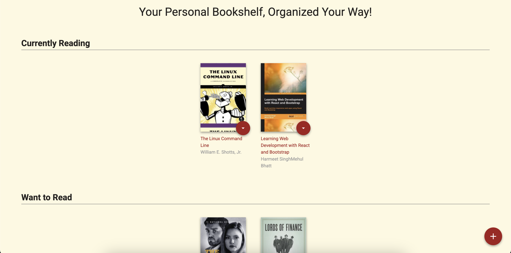

# MyReads
Check out MyReads at [here](https://dilkhush00.github.io/MyReads/)
## Table of Contents
- [MyReads](#MyReads)
- [Table of Contents](#table-of-contents)
- [Description](#description)
- [Technology Used](#technology-used)
- [Preview](#preview)
- [Prerequisite](#prerequisite)
- [Installation](#installation)

## Description
In MyRead app, user can select and categorize books in this app's bookshelf. This application utilizes [Udacity's Book API](https://github.com/udacity/reactnd-project-myreads-starter#backend-server) to get the books. This app also has search functionality to search the book. 
**Use [SEARCH_TERMS.md](./SEARCH_TERMS.md) for searching keywords**

## Technology Used
This application is mainly built with React.js 


## Preview



## Prerequisite
-  You must have `Node.js` installed on your computer

## Installation
1. Clone the repo
```sh
git clone https://github.com/DIlkhush00/MyReads
``` 
2. Run the following Command in terminal to install necessary dependencies
```sh
npm install
```

3.  Finally, run the following command
```sh
npm run start
```
4. Your application should be running on  `http://localhost:3000/`
